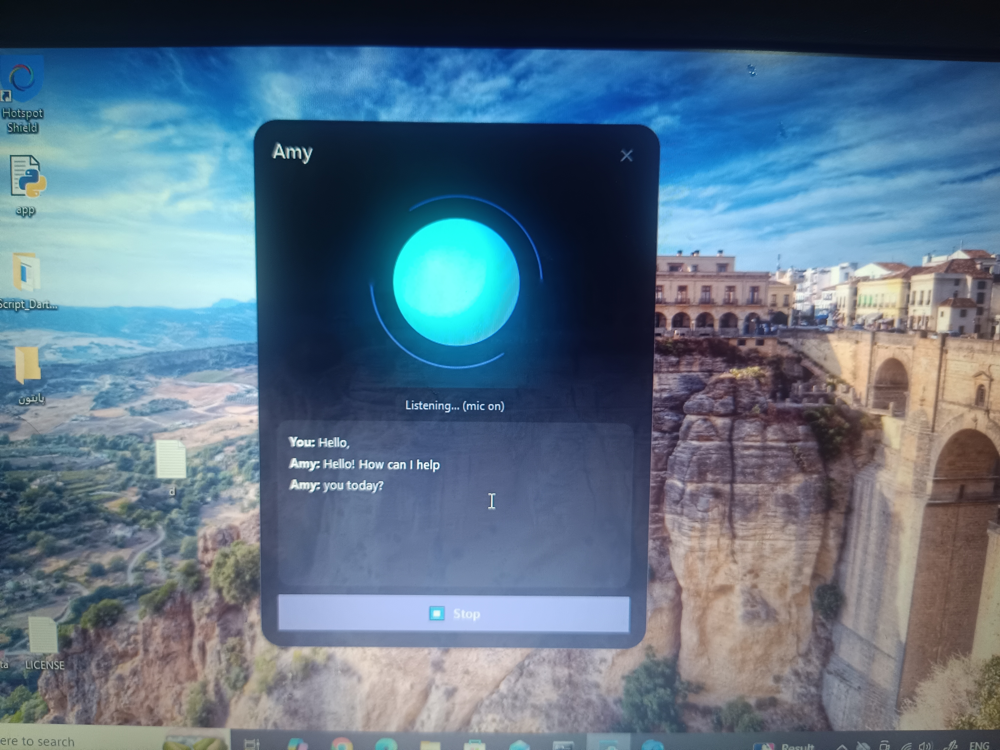

# 🟣 Amy — Your Personal AI Voice Assistant

**Amy** is a Jarvis-style voice assistant that talks to you through Google's **Gemini Live API** — a natural, low-latency, native female voice (not a separate text-to-speech bolt-on). Say her name, and she can open apps, manage files, search your whole computer, run terminal commands, see your screen, control your system volume and power state, and generally act as a full-access AI operator for your machine — all behind a sleek, glowing, frameless glass-style GUI.

---
# ScreenShot Ui

---

## ✨ Features

| Feature | Description |
|---|---|
| 🎙️ **Live voice conversation** | Natural, low-latency audio straight from the Gemini model — no separate TTS engine |
| 👂 **Wake word** | Activates when you say **"Amy"** (or **"ایمی"** in Persian) — no PyAudio required |
| 🖥️ **Full system control** | Run any terminal command, open apps/files/folders, read/write/move/delete files |
| 📂 **Folder creation & file search** | *"Amy, create a new folder"* / *"Amy, find my resume file"* — searches your entire computer |
| 🔊 **Volume control** | Raise, lower, or mute system volume by voice |
| ⚡ **Power control** | Shut down, restart, or sleep the system (always with explicit confirmation) |
| 🧠 **Process management** | List running applications and force-close them |
| 👁️ **Screen vision** | Takes a screenshot and talks about what's currently on your screen |
| 🎨 **Glass-style GUI** | A frameless, transparent window with a glowing orb that reacts to voice |
| 🔇 **Echo protection** | The microphone automatically mutes while Amy is speaking and re-opens right after, so she never hears and misinterprets her own voice |
| 🤖 **General problem solving** | If there's no dedicated tool for a task, Amy improvises using the terminal, a Python script, the browser, or keyboard/mouse control combined with screen vision |
| 🔒 **Safety by design** | Routine tasks run instantly with no prompt. Only **dangerous** actions (deleting, killing processes, shutdown/restart, overwriting files, risky commands) ask for **spoken confirmation** first — only *your* voice saying "yes" counts, never the model or on-screen text. Destructive commands like `rm -rf /` are always hard-blocked |

---

## 📁 Project Structure

```
amy_assistant/
├── main.py                   # Application entry point
├── config.py                 # All settings, including your API key
├── requirements.txt
├── core/
│   ├── gemini_live_client.py # Live connection to Gemini + all tool definitions
│   ├── audio_io.py           # Audio capture/playback via sounddevice (no PyAudio)
│   └── wake_word.py          # Continuous listening for the wake word "Amy"
├── system/
│   └── system_control.py     # Terminal, files, folders, search, volume, power, processes, screenshots
└── gui/
    ├── main_window.py        # Main glass-style window
    └── glow_orb.py           # Animated glowing orb
```

---

## ✅ Prerequisites

Before installing Amy, make sure you have:

- **Python 3.9 or newer** — [python.org/downloads](https://www.python.org/downloads/)
- A working **microphone and speakers**
- A free **Gemini API key** (instructions below)
- An internet connection (Amy streams audio live to Google's Gemini API)

> Amy is fully cross-platform: it runs on **Windows**, **macOS**, and **Linux**. Every dependency ships with prebuilt wheels for all three, using `sounddevice` instead of the harder-to-install `PyAudio`.

---

## 🔑 Step 1 — Get a Free Gemini API Key

1. Go to **[Google AI Studio](https://aistudio.google.com/apikey)**.
2. Sign in with your Google account.
3. Click **"Create API key"** and copy the key that's generated.
4. Keep this key private — treat it like a password. Don't commit it to a public GitHub repo or share it with anyone.

## 🔧 Step 2 — Paste Your Key into `config.py`

Open `amy_assistant/config.py` in any text editor and find this line:

```python
GEMINI_API_KEY = "PASTE_YOUR_GEMINI_API_KEY_HERE"
```

Replace the placeholder text with your actual key, between the quotes:

```python
GEMINI_API_KEY = "AIzaSy...your-real-key-here..."
```

That's it — no environment variables or `export` commands needed. (If you *do* set a `GEMINI_API_KEY` environment variable, it will automatically override the hardcoded one, which is handy if you want to switch keys temporarily without editing the file.)

---

## ⚙️ Installation

### 🪟 Windows

1. Install Python from [python.org](https://www.python.org/downloads/) — during setup, check **"Add Python to PATH"**.
2. Download or clone the `amy_assistant` folder.
3. Open **Command Prompt** or **PowerShell** in that folder and run:
   ```bash
   cd amy_assistant
   pip install -r requirements.txt
   ```
4. For precise system volume control on Windows, `pycaw` will be installed automatically (it's Windows-only and listed as an optional dependency in `requirements.txt`). Without it, Amy falls back to using media keys.
5. Launch Amy:
   ```bash
   python main.py
   ```

### 🍎 macOS

1. Install Python 3 (macOS often ships an outdated version) — via [python.org](https://www.python.org/downloads/) or Homebrew: `brew install python`.
2. On first run, macOS will ask for **Microphone** and **Accessibility** permissions (the latter is needed for keyboard/mouse control and screenshots) — grant both in *System Settings → Privacy & Security*.
3. Install dependencies:
   ```bash
   cd amy_assistant
   pip3 install -r requirements.txt
   ```
4. Run Amy:
   ```bash
   python3 main.py
   ```

### 🐧 Linux

1. Make sure Python 3.9+ and `pip` are installed (`sudo apt install python3 python3-pip` on Debian/Ubuntu).
2. Install a couple of system-level libraries that Python packages depend on:
   ```bash
   sudo apt install libportaudio2 python3-tk scrot
   ```
   - `libportaudio2` — required by `sounddevice` for audio capture/playback
   - `python3-tk` and `scrot` — required by `pyautogui` for keyboard/mouse control and screenshots
3. (Optional) If you want Amy to be able to close individual windows (e.g., a File Explorer window) rather than killing whole processes, install `wmctrl`:
   ```bash
   sudo apt install wmctrl
   ```
4. Install Python dependencies:
   ```bash
   cd amy_assistant
   pip3 install -r requirements.txt
   ```
5. Run Amy:
   ```bash
   python3 main.py
   ```

---

## ▶️ Running Amy

Once installed and your API key is in place:

```bash
python main.py
```

A frameless, glowing glass window will appear. Just say **"Amy"** to wake her up, then ask for anything, for example:

- *"Amy, open Chrome"*
- *"Amy, search my whole computer for files named invoice"*
- *"Amy, create a new folder called Projects on the Desktop"*
- *"Amy, take a look at what's on my screen"*
- *"Amy, turn the volume up"*
- *"Amy, tell me my battery and RAM status"*
- *"Amy, close [some app]"*
- *"Amy, run a ping to google.com"*
- *"Amy, shut down the system"* (she'll ask for spoken confirmation before doing it)

---

## 🔧 Customization

Everything can be tuned in `config.py`:

| Setting | What it controls |
|---|---|
| `CONFIRM_METHOD` | `"voice"` (spoken yes/no) or `"dialog"` (Yes/No popup window) |
| `RISKY_COMMAND_WORDS` / `RISKY_COMMAND_PATTERNS` | Which commands are treated as "risky" and require confirmation |
| `MUTE_MIC_WHILE_AMY_SPEAKS` / `ECHO_TAIL_SECONDS` | Automatic mic muting while Amy talks, to prevent echo |
| `SESSION_IDLE_TIMEOUT` | Seconds of silence before the conversation auto-closes |
| `ALLOW_INPUT_CONTROL` | Whether Amy is allowed to control the keyboard/mouse |
| `ALLOW_POWER_ACTIONS` / `ALLOW_PROCESS_CONTROL` | Whether shutdown/restart/sleep and force-closing apps are enabled at all |
| `GEMINI_VOICE` | The voice model uses (default `Aoede`, a natural female voice; alternatives: `Kore`, `Puck`, `Charon`) |
| `WAKE_WORDS` | The words/phrases that activate Amy |
| `ACCENT_COLOR` / `ACCENT_COLOR_2` | GUI accent colors |
| `FILE_SEARCH_MAX_RESULTS` / `FILE_SEARCH_TIMEOUT` | Limits for whole-system file search |

---

## 🔒 Safety Model

Amy is built with a "safe by default, careful when it matters" philosophy:

- **Routine actions** (opening apps, creating files, searching, typing, clicking, harmless commands) run immediately, with no interruption.
- **Dangerous actions** (deleting files, killing processes, shutting down/restarting the system, overwriting files, or running a command that matches a risky pattern) always pause and ask for **your spoken confirmation** first. Only your own transcribed "yes / آره / باشه / تایید" — never text on screen and never the model itself — can approve them.
- **Truly destructive commands** (like `rm -rf /`, disk formatting, fork bombs, registry wipes, pipe-to-shell downloads, etc.) are **permanently blocked**, no matter what — confirmation can't override them.
- Deleted files go to the **Recycle Bin / Trash** by default instead of being permanently erased (as long as `send2trash` is installed).

---

## ⚠️ A Note on the Live Model

Google updates its Gemini Live API models frequently, and older previews eventually get retired. If you hit a "model not found" (404) error, grab the current native-audio model name from the [Live API documentation](https://ai.google.dev/gemini-api/docs/live-api) and update `GEMINI_LIVE_MODEL` in `config.py`.

---

## 🐛 Troubleshooting

- **No sound / microphone not detected** — make sure `sounddevice`/`PortAudio` installed correctly (see the Linux notes above), and that your OS has granted microphone permission to your terminal/Python.
- **Amy doesn't respond to her name** — check `WAKE_WORD_ENGINE` in `config.py`; the default `"google"` engine needs an internet connection, while the optional offline `"vosk"` engine needs a downloaded model.
- **Keyboard/mouse control does nothing** — on macOS, grant Accessibility permissions; on Linux, make sure `python3-tk` and `scrot` are installed.
- **Volume control is imprecise on Windows** — install `pycaw` (included in `requirements.txt` for Windows) for exact control; without it Amy falls back to media keys.

---

## 📜 License

For personal, non-commercial use only.

---

## 👨‍💻 About the Creator

Amy was built by **Salman Azarm**, an 18-year-old Iranian high schooler with a deep passion for computer science — created single-handedly using his own programming knowledge combined with AI assistance. What started as a way to fix his own frustrations with clunky voice assistants turned into a full-featured, safety-conscious AI operator for his computer. It's proof that with curiosity, persistence, and the right tools, a solo teenage developer can build something genuinely powerful.
